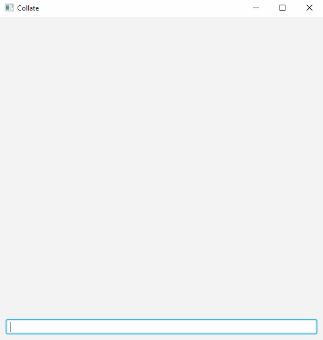

# Collate

Have you ever wanted to collate all your contributions to a project and see them in an easily readable file? How about comparing your contributions with other authors of a project?

Collate does all that and more! It is a simple tool that will scan a folder to find and collate parts of the code that you wrote. On top of being able to see everyone's overall contributions to the project, you can see the proportion of code an author wrote for files he/she contributed to.

It will export collated files formatted in Markdown. Example collated file: [Sebastian.md](collated/Sebastian.md)

**Want to use Collate?**
* [Download the latest release](https://github.com/collate/collate/releases) 
* [**User Guide**](docs/User-Guide.md)

**Want to contribute to Collate?**
* [**Developer Guide**](docs/Developer-Guide.md)
* [Dev Environment Setup](docs/Development-Environment-Setup.md)
* [Learning Resources](docs/Learning-Resources.md)
