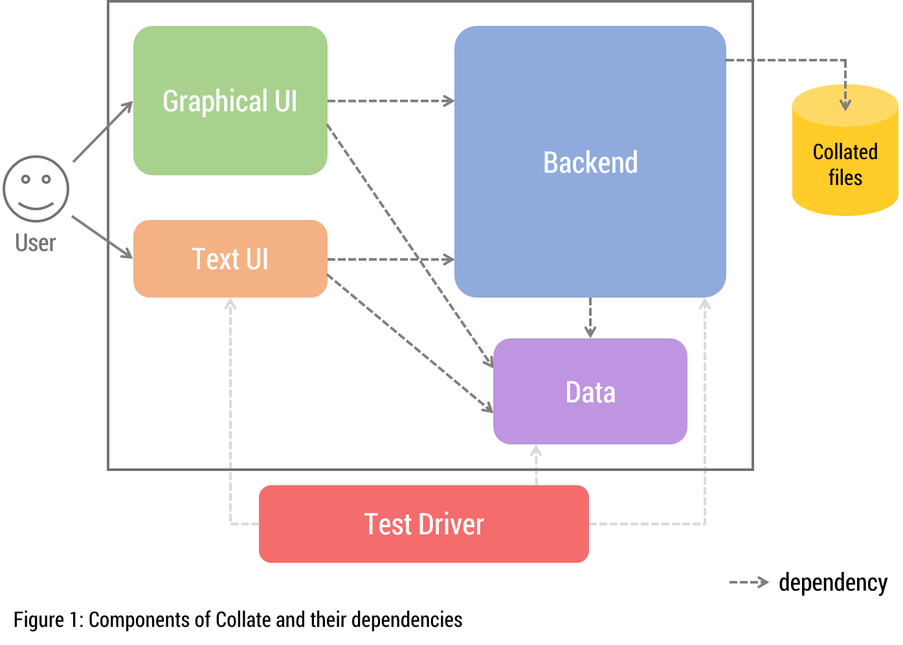
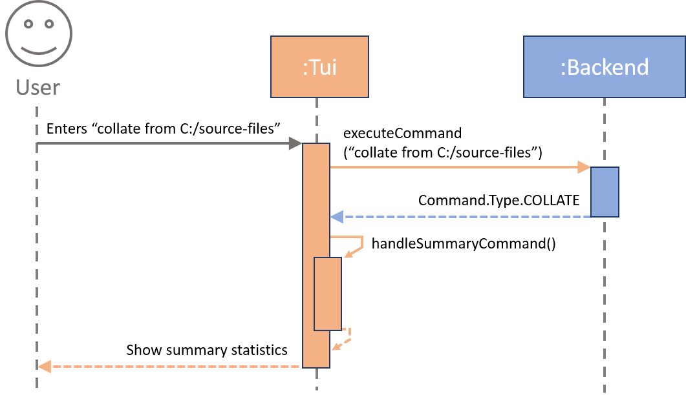
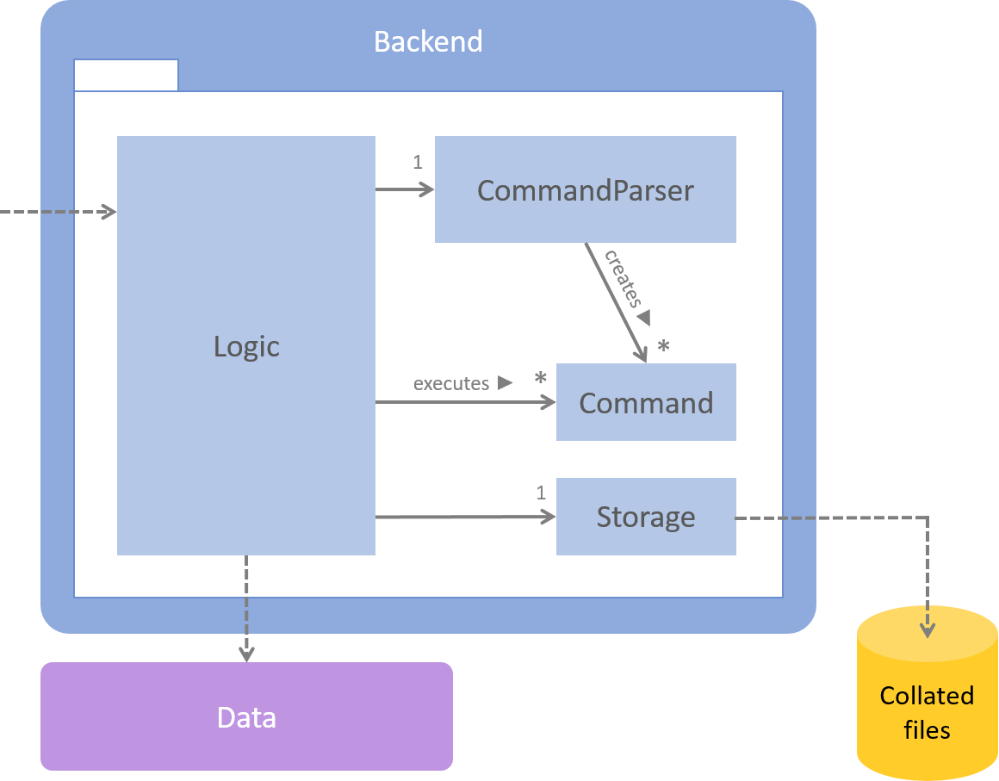
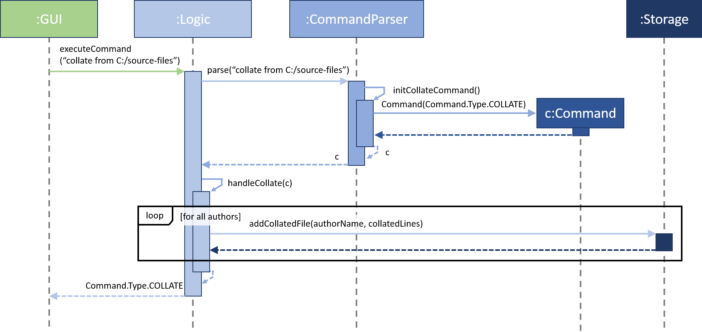
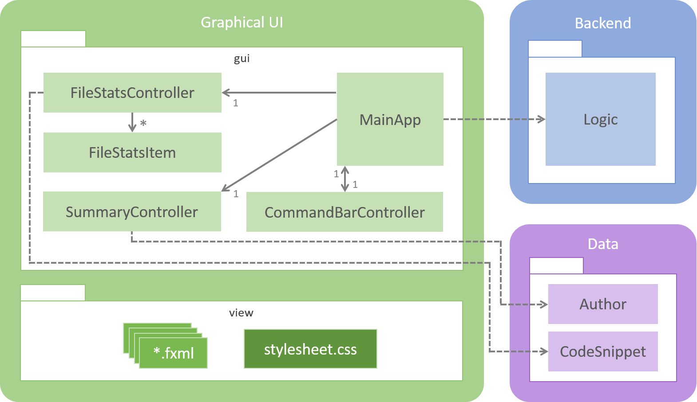
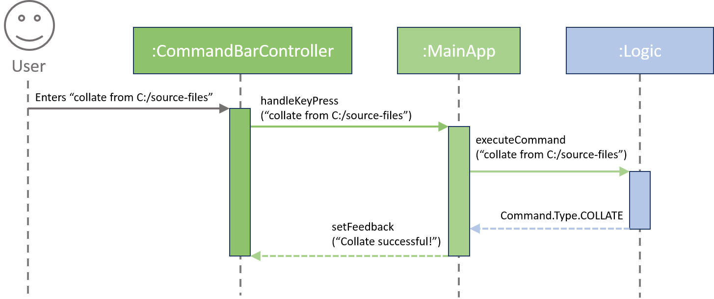

# Introduction
Collate is a simple tool for developers to consolidate the contributions of a project's authors into separate files. 
It is a Java desktop application that has both **a Text UI and a GUI**.

This guide describes the design and implementation of Collate. It will help you understand how Collate works 
and how you can further contribute to its development. We have organised this guide in a top-down manner 
so that you can understand the big picture before moving on to the more detailed sections.

# Table of Contents
<!-- MarkdownTOC -->

- [Architecture](#architecture)
- [Text UI component](#text-ui-component)
    - [`CollateTui` class](#collatetui-class)
- [Backend Component](#backend-component)
    - [`Logic` Class](#logic-class)
    - [`CommandParser` Class](#commandparser-class)
    - [`Storage` Class](#storage-class)
- [Data Component](#data-component)
    - [`Author` Class](#author-class)
    - [`CodeSnippet` Class](#codesnippet-class)
    - [`SourceFile` Class](#sourcefile-class)
- [GUI Component](#gui-component)
    - [`MainApp` Class](#mainapp-class)
    - [`CommandBarController` Class](#commandbarcontroller-class)
    - [`SummaryController` Class](#summarycontroller-class)
    - [`AuthorBean` Class](#authorbean-class)
    - [`FileStatsController` Class](#filestatscontroller-class)
    - [`FileStatsItem` Class](#filestatsitem-class)
- [Testing](#testing)
- [Future Development](#future-development)

<!-- /MarkdownTOC -->

# Architecture

> Figure 1: Components of Collate and their dependencies

Collate is made up of five main components. Users can either use Collate through the `GUI` 
or `TUI` (i.e. Text UI) components.

1. The **`GUI`** component consists of JavaFX's FXML files which define the layout that users interact with 
and the Java files which control these FXML files.
2. The **`TUI`** component is an alternative of the `GUI` component. Users can enter commands 
through the command line interface (CLI).
3. The **`Backend`** component contains all the logic needed to parse users' commands, store collated data 
into individual files, etc.
4. The **`Data`** component represents objects involved in the collation of source files such as the authors 
of the project and code snippets that were written.
5. The **`Test Driver`** component tests the `TUI`, `Backend` and `Data` components. It utilises 
JUnit for unit testing.

# Text UI component
This component is the entry point for Collate if you want to use Collate through the command line without 
a GUI. It consists of one class, `CollateTui` and interacts with the `Backend` and `Data` 
components to generate and display the appropriate statistics.

## `CollateTui` class
The `CollateTui` class receives commands from the command line and passes them to the `Logic` class in the 
Backend component to handle. `CollateTui` then decides which statistics to show in the command line. 
In addition to the Backend component, this class also relies on the Data component to show the 
appropriate statistics.

``` java
public static void main(String[] args) {
    ...
    Logic logic = new Logic();
    ...
    while (!isTimeToExit) {
        ...
        String userInput = input.nextLine();
        ...
        output.println(handleUserInput(logic, userInput));
    }
    ...
}

public static String handleUserInput(Logic logic, String userInput) {
    switch (logic.executeCommand(userInput)) {
        case COLLATE :
        case SUMMARY :
            return handleSummaryCommand(logic);
        case VIEW :
            return handleViewCommand(logic);
        case EXIT :
            isTimeToExit = true;
            return MESSAGE_EXIT;
        case INVALID :
        default :
            return handleInvalidCommand();
    }
}
```

The above code snippet shows you the main method which receives a user's input and passes it to 
`handleUserInput()`. This process repeats continuously until an exit command is entered.


> Figure 2: Component interactions at architectural level

# Backend Component

> Figure 3: Structure of the Backend component

At the centre of the `Backend` component is the `Logic` class which is in charge of handling the execution 
of user inputs from the GUI component. This component only relies on the Data component and works 
independently from the GUI and TUI components.

## `Logic` Class

> Figure 4: Object interactions for executing a basic collate command

The `Logic` class contains the methods that handle the core functionality of Collate. 
It can be thought of as the "brain" of Collate. User inputs are passed to the `executeCommand(String)` 
method which parses the input to find out what type of command the input is. Finding the type of command 
is done in the `CommandParser` class which will be elaborated in the next section.

After knowing the type of command, `Logic` executes the command and updates the its relevant fields 
before calling the `Storage` class to store the collated data if necessary. The data is stored in Markdown files. 
More details are mentioned in the `Storage` section.

The `executeCommand(String)` method will then return the type of command to its caller method. 
The caller method can then decide how to update the user interface.

This class provides several APIs for the user interface components (GUI and TUI) 
to obtain information and render them for the user.

#### Notable APIs
Return type | Method and Description
----------- | ----------------------
Command.Type | `executeCommand(String userInput)`: Handle the execution of user inputs.
Collection<Author> | `getAuthors()`: Get the authors of the project that has been collated.
String | `getTargetAuthorName()`: Get the name of the target author that was specified in the 
user's `view` command.
HashMap&lt;SourceFile, Integer&gt; | `getTargetAuthorStatistics()`: Get the statistics of the target 
author in the form of a `HashMap` with the keys as the `SourceFile` objects that the author contributed to 
and the values as the number of lines he/she wrote for that `SourceFile`.

## `CommandParser` Class
The `CommandParser` class figures out what type of command has been entered by the user. It creates `Command` 
objects which are then passed to `Logic` to be executed.

This class plays the important role of defining the fields in each `Command` object depending on the type of command. 
For example, if a user enters `view author1`, `CommandParser` creates a `Command` object that has its `authorName` 
initialised to "author1". These fields can then be accessed by `Logic` to execute the command properly.

#### Notable APIs
Return type | Method and Description
----------- | ----------------------
Command | `parse(String userInput)`: Analyses the given `userInput` to determine its type and returns a 
`Command` object with all the relevant fields initialised.

## `Storage` Class
`Storage` is a simple class that has one public method which takes in a list of lines and saves them to a 
local file in a default folder. This default folder is defined in this class.

The current implementation saves collated data in Markdown files. These files are human-readable and editable, 
and utilises syntax from [Github Flavored Markdown](https://help.github.com/articles/github-flavored-markdown/).

#### Notable APIs
Return type | Method and Description
----------- | ----------------------
void | `addCollatedFile(String fileName, ArrayList<String> collatedLines)`: Saves the `collatedLines` 
in the default save folder with `fileName` as its name and `.md` as its extension.

# Data Component

> Figure 5: Structure of the Data component

The Data component contains the classes that represent the various elements that are required in calculating 
contribution statistics.

`Logic` manipulates these classes and the UI components will use the data within these classes to render the 
display that users will see.

## `Author` Class
This class represents authors who have contributed to the project. Each `Author` can have multiple 
associated `CodeSnippet` objects.

## `CodeSnippet` Class
Each `CodeSnippet` represents the lines of code between two consecutive author tags that were written by an 
`Author`. Since this code belongs to a file, a `SourceFile` object is associated with each `CodeSnippet` object.

The `CodeSnippet` class has a static variable `totalLines`. This variable stores the total number of 
lines of code of all code snippets and is used to calculate the overall proportion of code each author wrote.

## `SourceFile` Class
This class represents source files that contain at least one author tag. Each `SourceFile` object is 
constructed with the file's path relative to the user's specified folder and the file's language. 
The base folder is specified through the `collate from <FOLDER>` command.

# GUI Component

> Check out the [Learning Resources](Learning-Resources.md) page to learn more about JavaFX.


> Figure 6: Structure of the GUI component

The GUI component is made up of two packages, `gui` and `view`. The `gui` package contains the 
Java files that control what users see while the `view` package contains JavaFX's `fxml` files that 
describe how to layout JavaFX components. A `stylesheet.css` is also found in the `view` package. 
This stylesheet customises the appearance and style of JavaFX components.



> Figure 7: Object interactions when a user enters a command through the GUI

Users will enter commands through the `CommandBarController`, which then passes these commands to the `MainApp`. 
`MainApp` will then call `Logic` in the Backend component to handle the actual execution of these commands.

`MainApp` is then responsible for correctly displaying and updating the GUI. Collate has two views that 
users can see, a `Summary` view and `FileStats` view which are controlled by their corresponding controller classes. 
These classes will be elaborated upon in the following sections.

## `MainApp` Class
The `MainApp` class is the main driver for the GUI component. It controls what users see and 
handles user inputs by passing them to the Backend component.

`MainApp` extends from JavaFX's `Application` class and overrides its `start` method. 
This method is the starting point of the whole application and very importantly, initialises all the 
components that are required for the GUI. This method also calls another method to load `RootLayout.fxml` 
from the `view` package. `RootLayout.fxml` contains the information about the layout of Collate's base components.

The `start` method then calls `initPrimaryStage(Stage)` as seen below. This method creates a new 
JavaFX `Scene` using this `RootLayout` and sets the main `Stage` to show this scene.

###### Code snippet from MainApp.java
``` java
private void initPrimaryStage(Stage primaryStage) {
    this.primaryStage = primaryStage;
    this.primaryStage.setTitle(WINDOW_TITLE);
    this.primaryStage.setScene(new Scene(rootLayout));
    this.primaryStage.show();
}
```
`RootLayout.fxml` is a type of JavaFX's `BorderPane` which in turn is a type of `Pane`. It allows us to 
layout JavaFX components by specifying which position of the `BorderPane` they should appear in, be 
it top, left, right, bottom or centre. The command bar where users enter commands in is positioned at the 
bottom and the statistics from the `collate` command is placed in the centre.

> You can also customise the height and width of the window by modifying the `prefHeight` and `prefWidth` 
parameters in `RootLayout.fxml`.

When a user presses any key, `MainApp` receives this information and decides what to do next. The current 
implementation listens for the enter key being pressed. The enter key is used by users to express their 
intent to execute the command they have typed out.

> This implementation allows Collate to be extended to listen for other keystrokes such as `tab`, `up`, `down`, etc.

#### Notable APIs
Return type | Method and Description
----------- | ----------------------
void | `handleKeyPress(CommandBarController commandBarController, KeyCode key, String userInput)`: 
Decides what to do when the `key` is entered.

## `CommandBarController` Class
The `CommandBarController` loads `CommandBar.fxml` which contains a JavaFX `TextField` for users to enter 
commands and a JavaFX `Label` which shows feedback when commands are entered.

`CommandBar.fxml`, similar to `RootLayout.fxml`, is a `BorderPane`. The `Label` is placed at the top of the 
`BorderPane` and the `TextField` is placed in the centre.

> As no preferred heights or widths are specified, JavaFX takes the default heights of the components and 
uses its parent container to calculate their widths. In the case of Collate, the `Label` and `TextField` 
inherit the width of `RooyLayout.fxml`. You can read more about `BorderPane` 
[here](https://docs.oracle.com/javase/8/javafx/api/javafx/scene/layout/BorderPane.html).

This class has a reference to `MainApp` and calls the `handleKeyPress` method of `MainApp` 
whenever a key is pressed. This ensures that the logic is handled by `MainApp` to avoid unnecessary 
coupling between `CommandBarController` and `Logic`.

#### Notable APIs
Return type | Method and Description
----------- | ----------------------
void | `clear()`: Clear the command bar
void | `setFeedback(String feedbackText)`: Set the text of the feedback label

## `SummaryController` Class
The `SummaryController` controls the default display after entering the `collate` command. It shows a 
table with three columns: author's name, lines of code and proportion of code written by the author.

This class loads `Summary.fxml` which is a type of `StackPane` (also a type of `Pane`) and contains a 
`TableView`. The `TableView` is simply a table and rows can be added to it.

> The use of `StackPane` ensures the `TableView` has a maximum height and width i.e fills the space given 
by its parent container.

`SummaryController` converts `Author` objects (from the `data` package) to their corresponding `AuthorBean` objects and 
construct rows based on certain attributes of the `AuthorBean` objects.

> More details of these JavaFX APIs can be found 
[here](https://docs.oracle.com/javase/8/javafx/api/javafx/scene/control/TableView.html).

## `AuthorBean` Class
The `AuthorBean` class is a wrapper for the `Author` class. It represents fields in the `Author` class in a way 
that makes it easier for the GUI to interact with.

`AuthorBean` objects have several fields of `Property` type. These class variables are special JavaFX constructs 
which behave in a similar manner as typical Java types such as integer, double and String types. For example, 
`AuthorBean` has a `IntegerProperty` type for its `linesOfCode` variable. This variable contains an integer 
which can be accessed by calling `linesOfCode.get()`.

By utilising JavaFX `Property` types, the GUI can interact indirectly with the `Author` class to render details 
in a table easily without sacrificing the semantics of the `Author` class.

> You can read more about JavaFX Properties [here](https://docs.oracle.com/javase/8/javafx/properties-binding-tutorial/binding.htm).

## `FileStatsController` Class
The `FileStatsController` controls the display that is shown when a user enters the `view` command. 
It shows the files that the specified target author has contributed to and the proportion 
of code he/she wrote in those files.

This class loads `FileStats.fxml` which is a type of `BorderPane` and has a `Label` positioned on top and 
a `ListView` positioned in the centre. The `Label` is used to indicate the target author's name and 
the `ListView` is used to show his/her contribution statistics.

This class' constructor requires a `HashMap` which maps `SourceFile` objects and the corresponding number 
of lines the target author has written for that `SourceFile`. It then uses this data to construct 
`FileStatsItem` objects to be shown in a `ListView`.

> `SourceFile` is part of the `data` package and each `SourceFile` object is a representation of a source 
file that has been collated.

A `ListView` contains objects of a certain type and these objects are laid out vertically. In this case, 
the `ListView` contains our custom `FileStatsItem` objects. JavaFX will then render these objects as per 
the layouts of the corresponding `FileStatsItem` objects which will be elaborated upon in the following section.

> By creating custom objects and using `ListView` to show them, you can create complex list-based layouts.

## `FileStatsItem` Class


> Figure 8: Appearance of a FileStatsItem

Each `FileStatsItem` object consists of nine JavaFX components.

1. `BorderPane` - The `FileStatsItem.fxml` is a `BorderPane` with a `StackPane` at its center.
2. `StackPane` - The outer container which facilitates the styling of the shadow of the object.
3. `HBox card` - Forms the inner container of this custom component and lays out its children horizontally.
4. `StackPane` - Forms the container for the `circle` and `percentage` components.
5. `Shape circle` - Coloured circle behind the percentage value.
6. `Text percentage` - The text that overlays the circle.
7. `VBox` - Lays out the `filename` and `linesOfCode` vertically
8. `Text filename`
9. `Text linesOfCode`

The `StackPane` allows the `percentage` to appear in front of the `circle`. The `card` `HBox` 
component has two children, first, this `StackPane` and second, the `VBox` that contains the 
`filename` and `linesOfCode`.

> The `StackPane` component enables you to position elements along the z-axis while 
the `HBox` and `VBox` components enable you to position elements along the x-axis and y-axis. 
Together, they allow you to create your own unique custom components.

This class' constructor has a percentage parameter which is used to generate a colour for the `circle`, 
with green indicating a higher percentage and red indicating a lower percentage.

This class also implements `Comparable` to enable sorting of `FileStatsItem` objects based on their percentage values.

# Testing
Collate uses JUnit to perform unit tests on the Backend, Data and TUI components. Every method is unit 
tested to ensure everything works as intended.

Tests are placed in the `src/test` folder and if you require that actual files be used for tests, you can 
place them in the `src/test/testFiles` folder. Be mindful to update existing tests that rely on the current 
source files within the `src/text/testFiles` folder.

# Future Development
There are several additions that can be made to Collate to further increase its usefulness and usability.

#### GUI testing
The current implementation does not perform any tests on the GUI component and relies solely on visual 
feedback to ensure the user interface is showing information correctly.

#### Saving and loading of statistics
By enabling users to save and load the statistics from a `collate` command, users will be able to view the 
progression of contributions of authors by collating at different stages of the project.

Furthermore, Collate can show a graph of contribution statistics based on these saved statistics.

#### Better command feedback
Having more specific feedback to users' commands will allow users to find that what exactly happened after 
the command was entered. Invalid commands will show more intelligent feedback based on what the user entered.

#### Auto-completion of commands
Allowing users to press a button to auto-complete a command makes it much easier to enter commands and 
reduces the margin of error.

#### History of commands
Users can traverse this history to re-execute previously typed commands. This becomes especially useful if a 
user wants to collate the source files in the same folder periodically.
