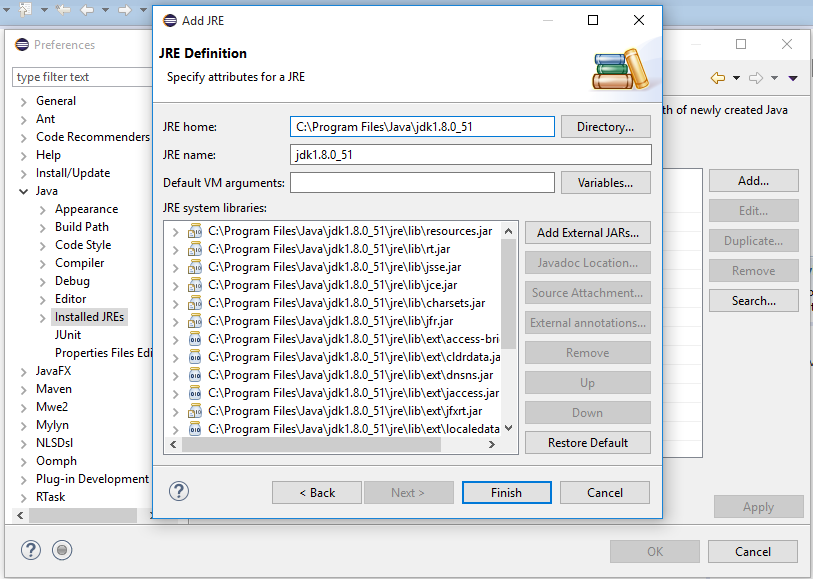
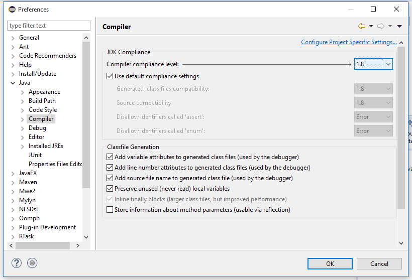
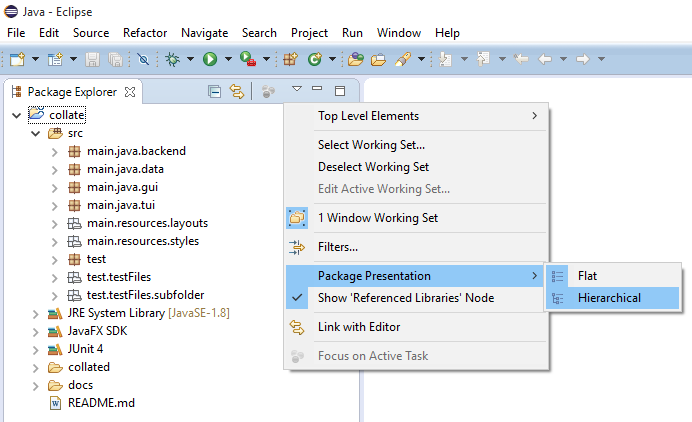
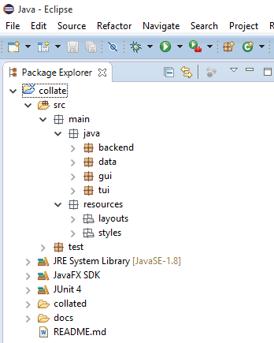
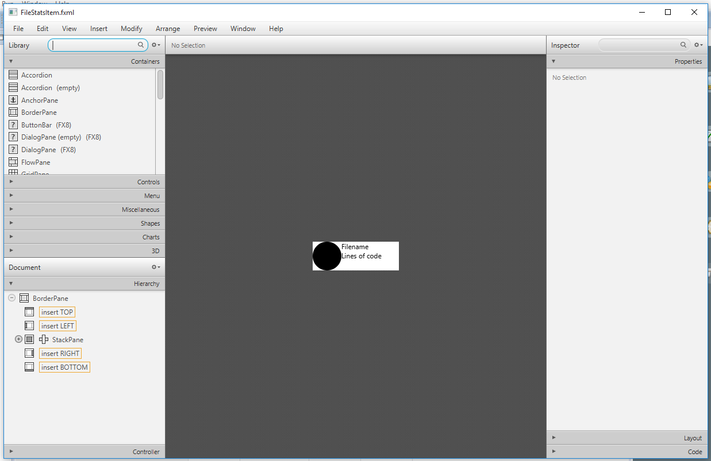
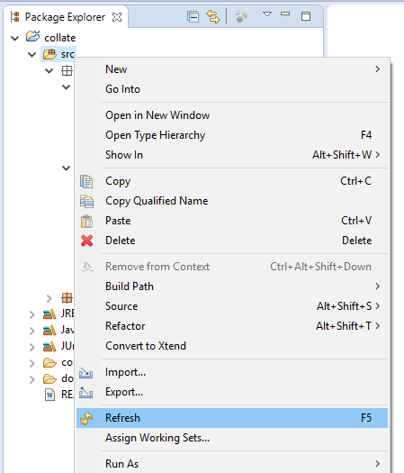
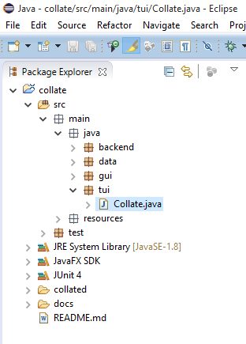
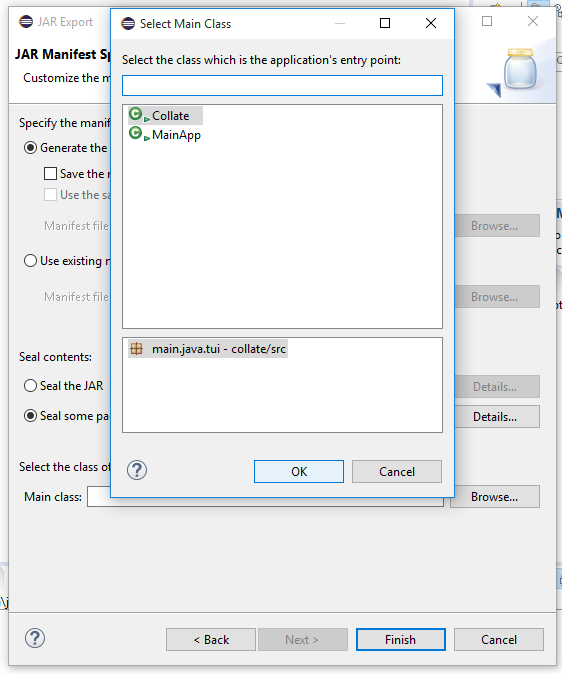

# Installation Guide
This guide aims to help you set up Collate, edit its source code and export it as `.jar` files.

<!-- MarkdownTOC -->

- [Setup development environment](#setup-development-environment)
    - [JDK 8u40 or later](#jdk-8u40-or-later)
    - [Eclipse Luna or later](#eclipse-luna-or-later)
    - [e(fx)clipse 1.2.0 or later](#efxclipse-120-or-later)
    - [Scene Builder 8.0.0 or later](#scene-builder-800-or-later)
- [Configure development environment](#configure-development-environment)
    - [Set SceneBuilder executable](#set-scenebuilder-executable)
    - [Set Java JDK](#set-java-jdk)
- [Import, edit and run Collate](#import-edit-and-run-collate)
    - [Download the latest release](#download-the-latest-release)
    - [Import project into Eclipse](#import-project-into-eclipse)
    - [Edit `.fxml` files](#edit-fxml-files)
    - [Run Collate](#run-collate)
- [Export Collate](#export-collate)
    - [Export GUI version](#export-gui-version)
    - [Export TUI version](#export-tui-version)
    - [Run exported jar](#run-exported-jar)

<!-- /MarkdownTOC -->

# Setup development environment
## JDK 8u40 or later

http://www.oracle.com/technetwork/java/javase/downloads/index.html

1. Click JDK download
2. Accept the license agreement and download the appropriate installation file

## Eclipse Luna or later

> Eclipse is the IDE that was used to develop Collate.

https://www.eclipse.org/downloads/

1. Download "Eclipse IDE for Java Developers"
2. Extract the contents to whichever directory you want. E.g. C:/eclipse

## e(fx)clipse 1.2.0 or later

> e(fx)clipse enables you to create new JavaFX FXML projects using Eclipse and start Scene Builder from within the IDE.

http://www.eclipse.org/efxclipse/install.html

Follow the installation instructions in the link above.

## Scene Builder 8.0.0 or later

> Scene Builder enables you to arrange components in JavaFX layouts through a GUI.

http://gluonhq.com/open-source/scene-builder/

Download and *install* Scene Builder using the link above. Do not download the executable jar as it will not work when attempting to open Scene Builder from Eclipse.

# Configure development environment

## Set SceneBuilder executable

1. Go to Window > Preferences
2. Click on JavaFX tab
3. Find the SceneBuilder executable. For Windows, it can be found here: `C:\Users\<USER>\AppData\Local\SceneBuilder\SceneBuilder.exe`
4. Click Apply

## Set Java JDK

1. In Preferences window, go to Java > Installed JREs
2. Remove the existing entries

3. Click Add...
4. Select Standard VM and click Next

5. Navigate to the directory of your installed JDK

6. Click Finish
7. Tick the checkbox beside this entry and click Apply

8. Go to Java > Compiler and ensure the Compiler compliance level is at least 1.8

# Import, edit and run Collate

## Download the latest release

1. Navigate to https://github.com/collate/collate/releases
2. Download and extract the source code of the latest release

## Import project into Eclipse

1. In Eclipse, go to File > Import...
2. Select General > Existing Projects into Workspace and click Next
3. Select root directory of the extracted source code and click Finish.

> The default view of the Package Explorer shows the packages in a flat manner. If you want to see packages in a hierarchical manner, click on the downward pointing triangle and change the Package Presentation.

## Edit `.fxml` files

> e(fx)clipse enables you to edit `.fxml` files using Scene Builder through Eclipse.

1. Right click on the `.fxml` file and click Open with SceneBuilder.

2. After you have saved your edits, refresh the project to ensure the latest `.fxml` files are used.

## Run Collate

### Run Graphical UI version

1. Open `MainApp.java` from the `gui` package
2. Click Run `MainApp.java`

### Run Text UI version

1. Open `Collate.java` from the `tui` package
2. Click Run `Collate.java`

# Export Collate

## Export GUI version

1. File > Export...
2. Select Java > Runnable JAR file

3. Select MainApp as the Launch configuration
4. Set Export destination
5. Ensure "Package required libraries into generated JAR" is selected
6. Click Finish

## Export TUI version

1. File > Export...
2. Select Java > JAR file
3. Select the src file to be exported and set the export destination

4. Click Next 2 times
5. Set the Main class
6. Click Finish

## Run exported jar
For the GUI version, simply double click on the jar file.
For the TUI version, follow the following steps:

1. Open a command window/terminal in the directory of the jar file

> For Windows, Shift+Right click in the directory of the jar file and click open command window here.

2. Enter `java -jar collate-tui.jar` (replace the filename accordingly)

