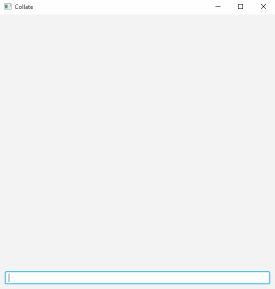
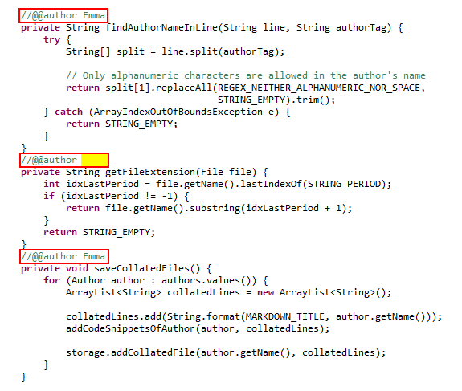
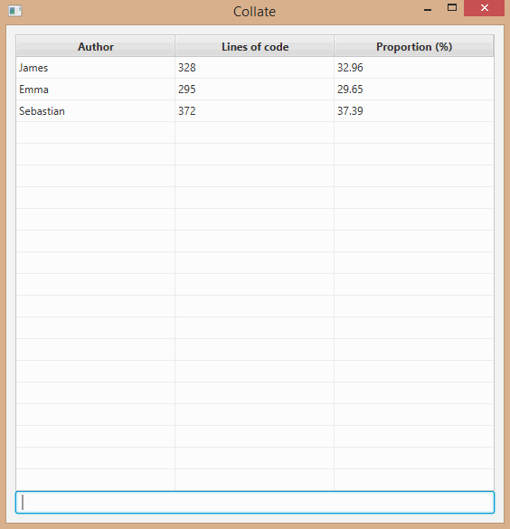
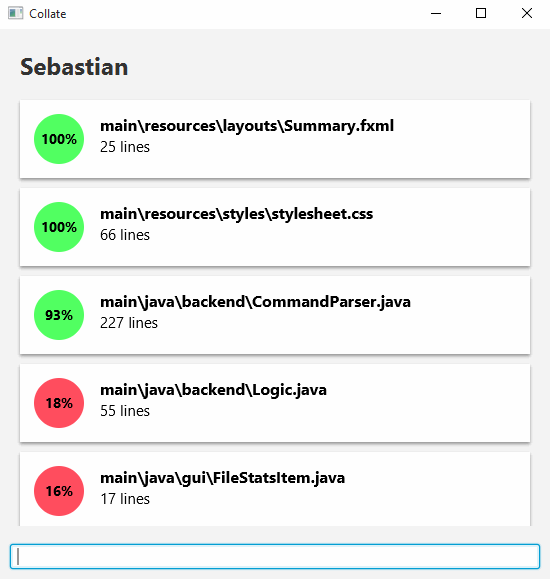
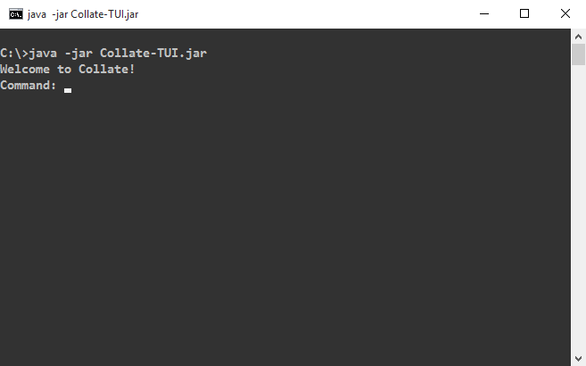
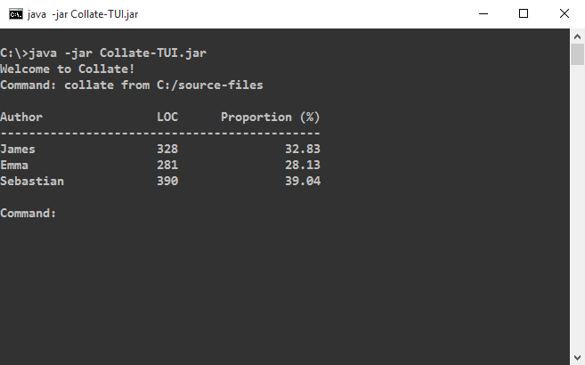
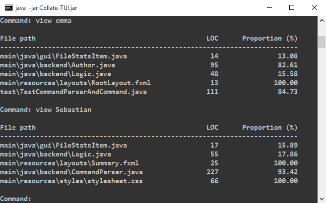

# About
Now that you know what Collate is [about](../README.md), you can follow this guide to learn how to use Collate effectively.

# Table of Contents
<!-- MarkdownTOC -->

- [Quick Start](#quick-start)
- [Feature Details](#feature-details)
  - [Marking code](#marking-code)
  - [Collating](#collating)
    - [Omitting sub folders](#omitting-sub-folders)
    - [Collating only certain types of files](#collating-only-certain-types-of-files)
  - [Viewing an author's statistics](#viewing-an-authors-statistics)
  - [Viewing the summary](#viewing-the-summary)
  - [Exiting](#exiting)
  - [Using the Text UI](#using-the-text-ui)
  - [Using the Batch mode](#using-the-batch-mode)
- [Cheatsheet](#cheatsheet)

<!-- /MarkdownTOC -->

# Quick Start

1. **Install JDK 8u40 or later**: Earlier Java version will not work. You can get it 
   [here] (http://www.oracle.com/technetwork/java/javase/downloads/index.html).

2. **Download Collate**: You can then download `Collate-GUI.jar` from the latest release 
   here: https://github.com/collate/collate/releases

3. **Mark your code with `@@author` tags**: Here are some examples.
   > For `.fxml` files, ensure that the `xml` tag comes before your author tags
   
   

4. **Launch Collate** Simply double-click on the `Collate-GUI.jar` file to start Collate. 
   You will be greeted with a simple interface that has a command bar. 
   This command bar is where you enter short commands to tell Collate what to do.  
   

5. **Ask Collate to collate your code**. As shown in the above animation, you can type 
   `collate from <INPUT_FOLDER>` to collate all files within `<INPUT_FOLDER>`
   including subfolders.
   
6. **View reports**: The reports can be found in the same folder as the jar file.
     You'll find one `.md` for each author, containing the code written by that author.
     [Here](https://github.com/collate/collate/blob/master/collated-example/Sebastian.md) is an example. 
     To specify a different output folder, user the command `collate from <INPUT_FOLDER> to <OUTPUT_FOLDER>`

7. **Try more commands**: 
     * `view <AUTHOR'S NAME>` - See author's individual statistics e.g. `view Sebastian`
     * `summary` - See the default statistics summary table
     * `exit` - Exit Collate using the command bar

To learn more details of Collate features, refer to the 'Feature Details' section below. 

# Feature Details
## Marking code
Using the `@@author` tag, you can specify the lines of code that you have written. 
Lines between your author tag and the next author tag will be marked as yours. 
Your name can include letters and numbers.
> Tip: Make sure to use the same name so that the code you wrote will be saved correctly in a single file.

You can include any type of file, as long as the `@@author` tag is present.

You can also use an *empty author tag* (i.e. an author tag without an author name) to mark end of your code segment.
Empty author tags are helpful to avoid claiming code written by another author who has yet to 
enter his/her author tags.

## Collating 

To collate files in a folder and all its sub folders, use this command.

`collate from <INPUT_FOLDER> to <OUTPUT_FOLDER>` (the `to <OUTPUT_FOLDER>` part is optional)

> Tip: If your folder includes whitespaces, you will need to surround the folder with double inverted commas.

Examples:
* `collate from src to collated`
* `collate from .`
* `collate from C:/myProject/component1/src to collated/src`
* `collate from "C:/source files"`

### Omitting sub folders
If you would like to collate files only from the specified folder, and not files from sub folders, 
you can add the `only` option.

`collate from <INPUT_FOLDER> only` or `collate only from <INPUT_FOLDER>`

> Tip: option order of the `collate` command is flexible. You need not worry about the position of these options, 
just remember to start each command with the `collate` keyword.

Examples:  
* `collate from C:/myProject/component1/src only`
* `collate only from C:/myProject/component1/src`

### Collating only certain types of files
Collate scans the folder you specified for all types of file. What if you want to collate only `java` files? 
Well, you can use the `include` option.

`collate from <INPUT_FOLDER> include java`

You can include multiple filetypes by separating them with commas.

`collate from <INPUT_FOLDER> include java, css, fxml`

Examples:  
* `collate from C:/src include java`
* `collate from C:/src to ./collated include java,md,css,txt`

## Viewing an author's statistics
Viewing an author's contribution statistics can be done by entering the following command.

`view <AUTHOR's NAME>`

> Tip: To make using Collate easier, the author's name is not case-sensitive.

This view allows you to see the proportion and number of lines of code the author wrote for 
files he/she contributed to.

## Viewing the summary
The summary view is the default screen that shows you the contributions of all authors. To access it, 
simply enter the following.

`summary`

## Exiting
Simply close the window or type the following command in the command bar.

`exit`

## Using the Text UI

Collate also provide a version that uses a Text UI instead of a GUI. 
To use it, first download the `Collate-TUI.jar` from the [same location](https://github.com/collate/collate/releases).
Then, open a command window in the same folder as `Collate-TUI.jar` and enter `java -jar Collate-TUI.jar`. 
You can then enter commands described earlier this this document within the command window.

Here are some examples:

## Using the batch mode

Collate Text UI can be run in 'batch mode' (i.e. non-interactive CLI) to execute a command in one shot.
Here's an example. 
`java -jar Collate-TUI.jar collate from src to collated`

# Cheatsheet
Command | Description
--------| ------------
`collate from <INPUT_FOLDER>` | Collates all files within `<INPUT_FOLDER>` including subfolders and puts the collated files in the same folder
`collate from <INPUT_FOLDER> to <OUTPUT_FOLDER>` | Collates all files within `<INPUT_FOLDER>` including subfolders and puts the collated files in the `<OUTPUT_FOLDER>`
`collate from <INPUT_FOLDER> only` | Collates files in `<INPUT_FOLDER>` only
`collate from <INPUT_FOLDER> include <FILETYPE1>, <FILETYPE2>` | Collates `<FILETYPE1>` and `<FILETYPE2>` files in `<INPUT_FOLDER>` and its subfolders
`collate from <INPUT_FOLDER> only include <FILETYPE1>` | Collates `<FILETYPE1>` files in `<INPUT_FOLDER>` only
`view <AUTHOR'S NAME>` | Shows author's individual statistics
`summary` | Shows default statistics summary table
`exit` | Exits Collate